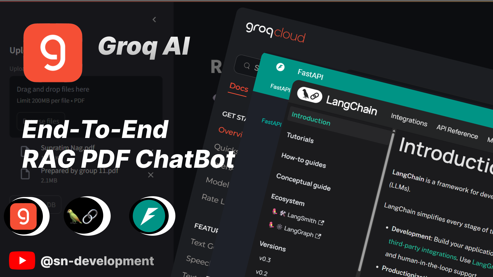

# 🧠 Modular RAG PDF Chatbot with FastAPI, ChromaDB & Streamlit

## 🎥 Watch the Tutorial

[](https://youtu.be/TxtK6NUUklQ)

This project is a modular **Retrieval-Augmented Generation (RAG)** application that allows users to upload PDF documents and chat with an AI assistant that answers queries based on the document content. It features a microservice architecture with a decoupled **FastAPI backend** and **Streamlit frontend**, using **ChromaDB** as the vector store and **Groq's LLaMA3 model** as the LLM.

---

## 📂 Project Structure

```
ragbot2.0/
├── client/         # Streamlit Frontend
│   |──components/
|   |  |──chatUI.py
|   |  |──history_download.py
|   |  |──upload.py
|   |──utils/
|   |  |──api.py
|   |──app.py
|   |──config.py
├── server/         # FastAPI Backend
│   ├── chroma_store/ ....after run
|   |──modules/
│      ├── load_vectorestore.py
│      ├── llm.py
│      ├── pdf_handler.py
│      ├── query_handlers.py
|   |──uploaded_pdfs/ ....after run
│   ├── logger.py
│   └── main.py
└── README.md
```

---

## ✨ Features

- 📄 Upload and parse PDFs
- 🧠 Embed document chunks with HuggingFace embeddings
- 💂️ Store embeddings in ChromaDB
- 💬 Query documents using LLaMA3 via Groq
- 🌍 Microservice architecture (Streamlit client + FastAPI server)

---

## 🎓 How RAG Works

Retrieval-Augmented Generation (RAG) enhances LLMs by injecting external knowledge. Instead of relying solely on pre-trained data, the model retrieves relevant information from a vector database (like ChromaDB) and uses it to generate accurate, context-aware responses.
cd server
>> C:\Users\91830\AppData\Local\Programs\Python\Python310\python.exe -m uvicorn main:app --reload
---

## 📊 Application Diagram

📄 [Download the Full Architecture PDF](assets/ragbot2.0.pdf)

---

## 🚀 Getting Started Locally

### 1. Clone the Repository

```bash
git clone https://github.com/snsupratim/RagBot-2.0.git
cd RagBot-2.0
```

### 2. Setup the Backend (FastAPI)

```bash
cd server
python -m venv venv
source venv/bin/activate  # Windows: venv\Scripts\activate
pip install -r requirements.txt

# Set your Groq API Key (.env)
GROQ_API_KEY="your_key_here"

# Run the FastAPI server
uvicorn main:app --reload
```

### 3. Setup the Frontend (Streamlit)

```bash
cd ../client
pip install -r requirements.txt  # if you use a separate venv for client
streamlit run app.py
```

---

## 🌐 API Endpoints (FastAPI)

- `POST /upload_pdfs/` — Upload PDFs and build vectorstore
- `POST /ask/` — Send a query and receive answers

Testable via Postman or directly from the Streamlit frontend.

---

## 🚧 TODO

- [ ] Add authentication for endpoints
- [ ] Dockerize the project
- [ ] Add support for more file types

---

## 🌟 Credits

- [LangChain](https://www.langchain.com/)
- [ChromaDB](https://www.trychroma.com/)
- [Groq](https://groq.com/)
- [Streamlit](https://streamlit.io/) (Legacy)
- [Next.js & Vercel](https://vercel.com/) (Production UI)
- [Firebase](https://firebase.google.com/)

---

## 🚢 Production Deployment

RagBot-2.0 is fully decoupled, meaning the frontend and backend are deployed separately.

### 1. Frontend (Next.js & Vercel)
Deploy the `/frontend` directory seamlessly on **Vercel**:
1. Connect your repository to Vercel and set the Root Directory to `frontend`.
2. Add the following **Environment Variables** in Vercel:
   ```env
   NEXT_PUBLIC_API_URL=https://your-backend-url.onrender.com
   NEXT_PUBLIC_FIREBASE_API_KEY=xxx
   NEXT_PUBLIC_FIREBASE_AUTH_DOMAIN=xxx
   NEXT_PUBLIC_FIREBASE_PROJECT_ID=xxx
   NEXT_PUBLIC_FIREBASE_STORAGE_BUCKET=xxx
   NEXT_PUBLIC_FIREBASE_MESSAGING_SENDER_ID=xxx
   NEXT_PUBLIC_FIREBASE_APP_ID=xxx
   NEXT_PUBLIC_FIREBASE_MEASUREMENT_ID=xxx
   ```
3. Deploy.

### 2. Backend (FastAPI & Render/Heroku)
Deploy the `/server` directory to a platform like **Render**, **Railway**, or **Heroku**:
1. Ensure the platform uses the provided `Procfile` (`web: uvicorn main:app --host 0.0.0.0 --port $PORT`).
2. Set the Root Directory to `server`.
3. Add the following **Environment Variables**:
   ```env
   PINECONE_API_KEY=xxx
   PINECONE_INDEX_NAME=xxx
   GROQ_API_KEY=xxx
   FRONTEND_URL=https://your-frontend-url.vercel.app  # Important for CORS
   ```
4. Deploy.

### 3. Database (Firebase Firestore Rules)
Deploy the following `firestore.rules` snippet to secure your active chat sessions and documents:
```javascript
rules_version = '2';
service cloud.firestore {
  match /databases/{database}/documents {
    match /sessions/{sessionId} {
      allow read, write: if request.auth != null && request.auth.uid == resource.data.userId || request.auth.uid == request.resource.data.userId;
    }
  }
}
```

---

## ✉️ Contact

For questions or suggestions, open an issue or contact at [snsupratim@gmail.com]

---

> Happy Building RAGbots! 🚀
